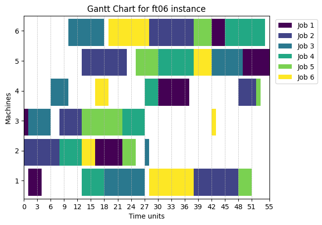
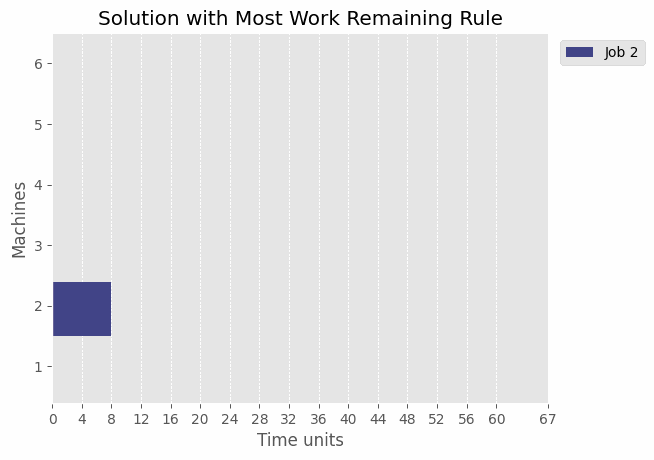
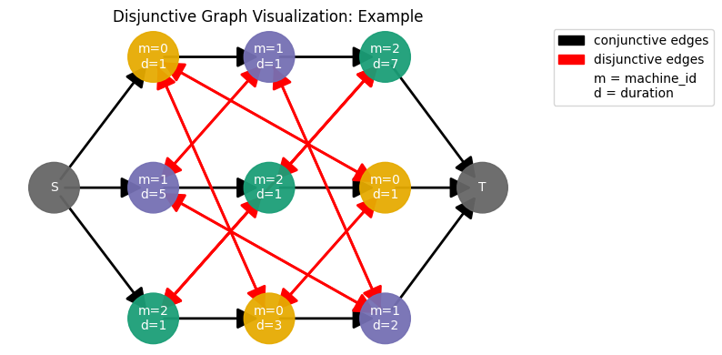
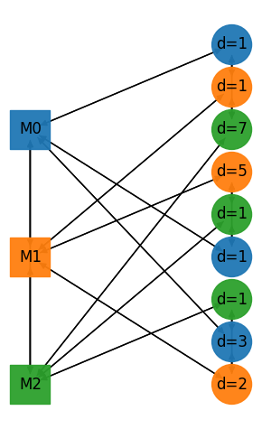

# job_shop_lib
[](https://github.com/Pabloo22/job_shop_lib/actions/workflows/tests.yaml)

[](https://github.com/psf/black)
[](https://opensource.org/licenses/MIT)


An easy-to-use and modular Python library for the Job Shop Scheduling Problem (JSSP) with a special focus on graph representations.

It provides intuitive data structures to represent instances and solutions, as well as solvers and visualization tools:

## Quick Start

### Create a Job Shop Instance

You can create a Job Shop Instance by defining the jobs and operations. An operation is defined by the machine(s) it is processed on and the duration (processing time).

```python
from job_shop_lib import JobShopInstance, Operation

CPU = 0
GPU = 1
DATA_CENTER = 2

job_1 = [Operation(CPU, 1), Operation(GPU, 1), Operation(DATA_CENTER, 7)]
job_2 = [Operation(GPU, 5), Operation(DATA_CENTER, 1), Operation(CPU, 1)]
job_3 = [Operation(DATA_CENTER, 1), Operation(CPU, 3), Operation(GPU, 2)]

jobs = [job_1, job_2, job_3]

instance = JobShopInstance(
    jobs,
    name="Example",
    # Any extra parameters are stored inside the
    # metadata attribute as a dictionary:
    lower_bound=7,
)
```

### Load a Benchmark Instance

You can load a benchmark instance from the library

```python
from job_shop_lib.benchmarks import load_benchmark_instance

ft06 = load_benchmark_instance("ft06")
```

The module `benchmarks` functions to load the instances from the file and return them as `JobShopInstance` objects without having to download them
manually. The instances are stored in [benchmark_instances.json](job_shop_lib/benchmarks/benchmark_instances.json).

The contributions to this benchmark dataset are as follows:

- `abz5-9`: This subset, comprising five instances, was introduced by Adams et
    al. (1988).

- `ft06`, `ft10`, `ft20`: These three instances are attributed to the work of
    Fisher and Thompson, as detailed in their 1963 work.

- `la01-40`: A collection of forty instances, this group was contributed by
    Lawrence, as referenced in his 1984 report.

- `orb01-10`: Ten instances in this category were provided by Applegate and
    Cook, as seen in their 1991 study.

- `swb01-20`: This segment, encompassing twenty instances, was contributed by
    Storer et al., as per their 1992 article.

- `yn1-4`: Yamada and Nakano are credited with the addition of four instances
    in this group, as found in their 1992 paper.

- `ta01-80`: The largest contribution, consisting of eighty instances, was
    made by Taillard, as documented in his 1993 paper.

The metadata from these instances has been updated using data from:

Thomas Weise. jsspInstancesAndResults. Accessed in January 2024.
Available at: https://github.com/thomasWeise/jsspInstancesAndResults

It includes the following information:
  - "optimum" (`int` | `None`): The optimal makespan for the instance.
  - "lower_bound" (`int`): The best lower bound known for the makespan. If
      optimality is known, it is equal to the optimum.
  - "upper_bound" (`int`): The best upper bound known for the makespan. If
      optimality is known, it is equal to the optimum.
  - "reference" (`str`): The paper or source where the instance was first
      introduced.

```python
>>> ft06.metadata
{'optimum': 55,
 'upper_bound': 55,
 'lower_bound': 55,
 'reference': "J.F. Muth, G.L. Thompson. 'Industrial scheduling.', Englewood Cliffs, NJ, Prentice-Hall, 1963."}
```

### Generate a Random Instance

You can also generate a random instance with the `InstanceGenerator` class.

```python
generator = InstanceGenerator(
    duration_range=(5, 10), seed=42, num_jobs=5, num_machines=5
)
random_instance = generator.generate()
```

This class can also work as an iterator to generate multiple instances:

```python
generator = InstanceGenerator(iteration_limit=100, seed=42)
instances = list(generator)
```

### Solve an Instance with the OR-Tools' Constraint-Programming Solver

Every solver is a `Callable` that receives a `JobShopInstance` and returns a `Schedule` object.

```python
import matplotlib.pyplot as plt

from job_shop_lib.solvers import CPSolver
from job_shop_lib.visualization import plot_gantt_chart

plt.style.use("ggplot")

solver = CPSolver(max_time_in_seconds=10)
ft06_schedule = solver(ft06)

fig, ax = plot_gantt_chart(ft06_schedule)
plt.show()
```


### Solve an Instance with a Dispatching Rule Solver

A dispatching rule is a heuristic guideline used to prioritize and sequence jobs on various machines. Supported dispatching rules are:

```python
class DispatchingRule(str, Enum):
    SHORTEST_PROCESSING_TIME = "shortest_processing_time"
    FIRST_COME_FIRST_SERVED = "first_come_first_served"
    MOST_WORK_REMAINING = "most_work_remaining"
    RANDOM = "random"
```

We can visualize the solution with a `DispatchingRuleSolver` as a gif:

```python
from job_shop_lib.visualization import create_gif, get_plot_function
from job_shop_lib.solvers import DispatchingRuleSolver, DispatchingRule

mwkr_solver = DispatchingRuleSolver("most_work_remaining")
plot_function = get_plot_function(title="Solution with Most Work Remaining Rule")
create_gif(
    gif_path="ft06_optimized.gif",
    instance=ft06,
    solver=mwkr_solver,
    plot_function=plot_function,
    fps=4,
)
```



The dashed red line represents the current time step, which is computed as the earliest time when the next operation can start.

### Representing Instances as Graphs

One of the main purposes of this library is to provide an easy way to encode instances as graphs. This can be very useful, not only for visualization purposes but also for developing Graph Neural Network-based algorithms.

A graph is represented by the `JobShopGraph` class, which internally uses the `networkx` library.

####  Disjunctive Graph

The disjunctive graph is created by first adding nodes representing each operation in the jobs, along with two special nodes: a source $S$ and a sink $T$. Each operation node is linked to the next operation in its job sequence by **conjunctive edges**, forming a path from the source to the sink. These edges represent the order in which operations of a single job must be performed.

Additionally, the graph includes **disjunctive edges** between operations that use the same machine but belong to different jobs. These edges are bidirectional, indicating that either of the connected operations can be performed first. The disjunctive edges thus represent the scheduling choices available: the order in which operations sharing a machine can be processed. Solving the Job Shop Scheduling problem involves choosing a direction for each disjunctive edge such that the overall processing time is minimized.

```python
from job_shop_lib.graphs import build_disjunctive_graph
from job_shop_lib.visualization import plot_disjunctive_graph

disjunctive_graph = build_disjunctive_graph(instance)
fig = plot_disjunctive_graph(disjunctive_graph)
plt.show()
```




The `JobShopGraph` class provides easy access to the nodes, for example, to get all the nodes of a specific type:

```python
 >>> graph.nodes_by_type
 defaultdict(list,
            {<NodeType.OPERATION: 1>: [Node(node_type=OPERATION, value=O(m=0, d=1, j=0, p=0), id=0),
              Node(node_type=OPERATION, value=O(m=1, d=1, j=0, p=1), id=1),
              Node(node_type=OPERATION, value=O(m=2, d=7, j=0, p=2), id=2),
              Node(node_type=OPERATION, value=O(m=1, d=5, j=1, p=0), id=3),
              Node(node_type=OPERATION, value=O(m=2, d=1, j=1, p=1), id=4),
              Node(node_type=OPERATION, value=O(m=0, d=1, j=1, p=2), id=5),
              Node(node_type=OPERATION, value=O(m=2, d=1, j=2, p=0), id=6),
              Node(node_type=OPERATION, value=O(m=0, d=3, j=2, p=1), id=7),
              Node(node_type=OPERATION, value=O(m=1, d=2, j=2, p=2), id=8)],
             <NodeType.SOURCE: 5>: [Node(node_type=SOURCE, value=None, id=9)],
             <NodeType.SINK: 6>: [Node(node_type=SINK, value=None, id=10)]})
```

#### Agent-Task Graph

Introduced in the paper "ScheduleNet: Learn to solve multi-agent scheduling problems with reinforcement learning" by [Park et al. (2021)](https://arxiv.org/abs/2106.03051), the Agent-Task Graph is a graph that represents the scheduling problem as a multi-agent reinforcement learning problem.

In contrast to the disjunctive graph, instead of connecting operations
that share the same resources directly by disjunctive edges, operation
nodes are connected with machine ones.

All machine nodes are connected between them, and all operation nodes
from the same job are connected by non-directed edges too.

```python
from job_shop_lib.graphs import (
    build_complete_agent_task_graph,
    build_agent_task_graph_with_jobs,
    build_agent_task_graph,
)
from job_shop_lib.visualization import plot_agent_task_graph

complete_agent_task_graph = build_complete_agent_task_graph(instance)

fig = plot_agent_task_graph(complete_agent_task_graph)
plt.show()
```



For more details, check the [tutorial](tutorial) folder.

## Installation

In the future, the library will be available on PyPI. For now, you can install it from the source code.

### For development

#### With Poetry

1. Clone the repository.

2. Install [poetry](https://python-poetry.org/docs/) if you don't have it already:
```bash
pip install poetry==1.7
```
3. Create the virtual environment:
```bash
poetry shell
```
4. Install dependencies:
```bash
poetry install --with notebooks --with test --with lint --all-extras
```
or equivalently:
```bash
make poetry_install_all 
```

#### With PyPI

If you don't want to use Poetry, you can install the library directly from the source code:

```bash
git clone https://github.com/Pabloo22/job_shop_lib.git
cd job_shop_lib
pip install -e .
```

## License

This project is licensed under the MIT License - see the [LICENSE](LICENSE) file for details.


## References

 - J. Adams, E. Balas, and D. Zawack, "The shifting bottleneck procedure
     for job shop scheduling," Management Science, vol. 34, no. 3,
     pp. 391–401, 1988.

 - J.F. Muth and G.L. Thompson, Industrial scheduling. Englewood Cliffs,
     NJ: Prentice-Hall, 1963.

 - S. Lawrence, "Resource constrained project scheduling: An experimental
     investigation of heuristic scheduling techniques (Supplement),"
     Carnegie-Mellon University, Graduate School of Industrial
     Administration, Pittsburgh, Pennsylvania, 1984.

 - D. Applegate and W. Cook, "A computational study of job-shop
     scheduling," ORSA Journal on Computer, vol. 3, no. 2, pp. 149–156,
     1991.

 - R.H. Storer, S.D. Wu, and R. Vaccari, "New search spaces for
     sequencing problems with applications to job-shop scheduling,"
     Management Science, vol. 38, no. 10, pp. 1495–1509, 1992.

 - T. Yamada and R. Nakano, "A genetic algorithm applicable to
     large-scale job-shop problems," in Proceedings of the Second
     International Workshop on Parallel Problem Solving from Nature
     (PPSN'2), Brussels, Belgium, pp. 281–290, 1992.

 - E. Taillard, "Benchmarks for basic scheduling problems," European
     Journal of Operational Research, vol. 64, no. 2, pp. 278–285, 1993.

- Park, Junyoung, Sanjar Bakhtiyar, and Jinkyoo Park. "ScheduleNet: Learn to solve multi-agent scheduling problems with reinforcement learning." arXiv preprint arXiv:2106.03051, 2021. 